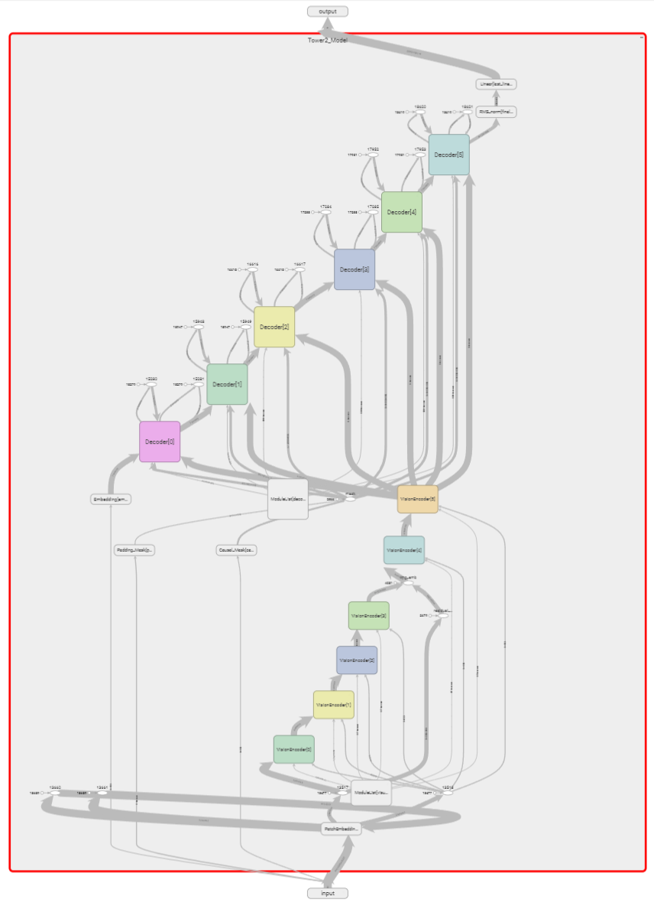

# Tower2 - 多模态语言模型架构


**Tower2**是几乎集成了当今所有最先进的LLM机制的模型架构 <br>
本项目是[Tower_GPT](https://github.com/midway2333/tower_gpt)的续项目

## 介绍 👋

### 主要特性 🌟

- **多模态**：支持文本、图像输入
- **高效**：使用了MoE、MLA等先进技术提高模型的计算和存储效率
- **扩展**：几乎所有参数都可以通过配置文件进行修改
- **可解释性**：完整的中文代码注释
- **原生实现**：不依赖`transformer`等衍生库，全部基于`Pytorch`实现

### 技术对比 ⚙️

| 特性 |Tower GPT| Tower 2 | LLaMA 3 | Qwen 2.5 | DeepSeek V3 / R1 |
| :----: | :----: | :----: | :----: | :----: | :----: |
| 注意力 | MHA | **MLA** | GQA | GQA | MLA |
|前馈网络| FFN | **MoE / FFN** | FFN | MoE / FFN | MoE |
|多模态| 否 | **是** | 是 | 是 | 否 |
|KV Cache| 否 |**是**| 是 | 是 | 是 |
|激活函数|GELU|**SwiGLU / GELU**|SwiGLU|SwiGLU|SwiGLU|
|开源协议|MIT|**CC-0**|LLaMA3 License|Apache 2.0| MIT |

### 环境需求 🛠️

```
    Python 3.10+
    Pytorch 2.0+
    Sentencepiece
    Galore-torch
```

或者使用[subsoil](https://github.com/midway2333/subsoil)快速设置开发环境

### 模型架构 🧠



## 协议与贡献 📜

### 未来计划 📌

#### 🟢 近期计划

- KV Cache (已完成)
- 音频多模态

#### 🔵 长期规划

- 训练代码

### 源代码 🗂️

- **许可证**: [CC0](https://creativecommons.org/public-domain/cc0/)
-  <br>
- **您可以**：
  - 自由地复制、修改、分发和执行作品
  - 无需署名，无需保留版权声明

### 问题与贡献 🤔

- **问题反馈与建议提供**: [提交Issue](https://github.com/midway2333/tower2/issues)

### 更新日志 📝

<details open> 
<summary>  <b>25.4.13更新</b> </summary>
- KV Cache 支持 <br>
- 残差连接修正 <br>
</details>
